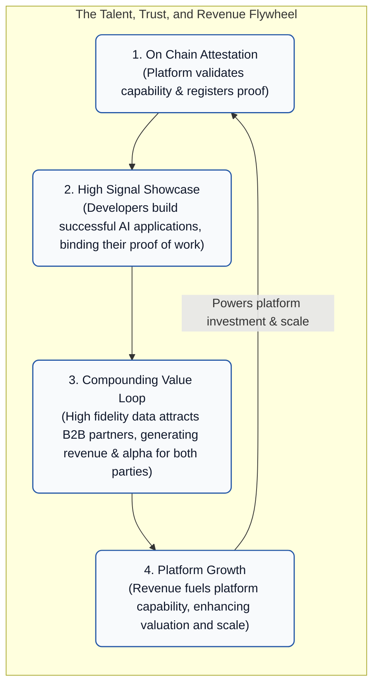
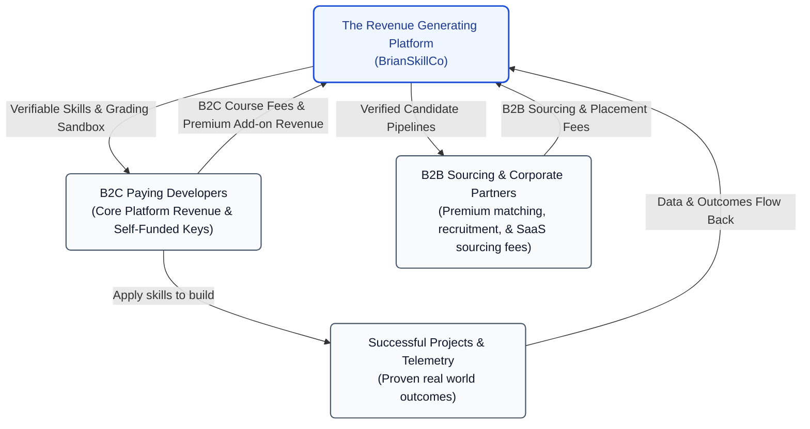

# Immutable Portable Proof of Work: Coupling Platforms & Protocols for High Growth Networks

Cryptographic primitives for extending an existing skill validation platform into a trustless, decentralized proof of work validation protocol. By complementing standard on platform completion records, this protocol allows validated skills to **travel with the developer wherever they go**, enabling embedding, signing, and verification of validated capabilities directly within real world applications, code repositories, and production deployments.

When successful developers showcase these portable, cryptographically signed projects, it functions as a high integrity proof of work that attracts additional learners to the platform, creating a self reinforcing flywheel of growth and monetization. All verified outcomes—including telemetry data—are cryptographically streamed back to the platform core to maintain a complete record of capability.

---

## Table of Contents

*   **[Part I: Business Integration & Ecosystem Design](#part-i-business-integration--ecosystem-design)**
    *   [1. System Design: Cryptographic Validation as a Network Effect and Value Multiplier](#1-system-design-cryptographic-validation-as-a-network-effect-and-value-multiplier)
    *   [2. Cryptographic Ledger Independence: Blockchain and Crypto Wallets are Optional](#2-cryptographic-ledger-independence-blockchain-and-crypto-wallets-are-optional)
    *   [3. The Portable Passport Analogy](#3-the-portable-passport-analogy)
    *   [4. The Direct Business Value of Cryptographic Primitives](#4-the-direct-business-value-of-cryptographic-primitives)
    *   [5. Unified Trust Scenarios: Internal Platform Automation vs. External Proof Exporting](#5-unified-trust-scenarios-internal-platform-automation-vs-external-proof-exporting)
    *   [6. Centralized Web2 KMS vs. Trustless Blockchain Registry: Why Both Matter](#6-centralized-web2-kms-vs-trustless-blockchain-registry-why-both-matter)
*   **[Part II: The Technical Implementation](#part-ii-the-technical-implementation)**
    *   [1. Verifiable Claim Stack Specifications](#1-verifiable-claim-stack-specifications)
    *   [2. Run the `rag-ai` MVP Locally](#2-run-the-rag-ai-mvp-locally)
    *   [3. Trust Architecture & Key Management](#3-trust-architecture--key-management)
    *   [4. Real Production Next Steps](#4-real-production-next-steps)
    *   [5. Implementation Surfaces](#5-implementation-surfaces)

---

# Part I: Business Integration & Ecosystem Design

This section details the system architecture, visual workflows, and monetization integration model of the protocol. It explains how coupling a platform and a protocol optimizes validation flows, reduces trust dependencies, and streamlines career outcomes.

---

## 1. System Design: Cryptographic Validation as a Network Effect and Value Multiplier

### The Validation Layer and B2B Trust Gap
Modern software ecosystems lack a standard, programmatic mechanism to verify live codebase capabilities, creating a significant **trust gap** in the hiring market, contractor sourcing, and engineering collaboration. Conventional platforms rely on static badges or manual review, which fail to provide the high fidelity evidence required for professional B2B reconciliation.

This protocol acts as an **objective, decentralized validation layer** that shifts the model from static badge registration to **verifiable proof of work portfolios**. By coupling a B2C learning platform with a decentralized protocol, learners build practical, hands-on projects, generating authenticated cryptographic evidence that proves actual, live capability to employers with zero friction.

### Cryptographic Validation Protocol
The registry operates as an objective, programmatic validation layer that anchors a developer's real world proof of work on-chain:

1.  **Codebase Evidence Binding**: Developers generate a unique cryptographic hash (`evidenceBinding`) of their project (e.g., git commit SHA, directory state, or deployment digest). This hash, representing the actual work performed, is registered on-chain.
2.  **Cryptographic Endorsement**: Once the project evidence is registered, the validation authority submits a co-signature to the registry contract. This endorsement cryptographically binds the developer's holder key to the validated project evidence, creating an immutable, audit-ready record.
3.  **Trustless Verification**: Employers and recruiters query the registry directly to verify the codebase hash and cryptographic signature. This confirms that the proof of work matches the registered attestation ID and was signed by the bound holder key—all without requiring any database lookups, platform API calls, or Web3 wallet complexity.

This validation layer enables B2B entities to programmatically verify live software capability, streamline vendor vetting, and establish a verifiable reputation ledger based on empirical, deterministic data.

### The Continuous Capability Network
This protocol creates a travelable, self-reinforcing **Capability Network**:



### The Compounding Alpha Loop
Showcasing successful, validated AI applications acts as the platform's primary engine:
*   **Top of Funnel Acceleration**: High-visibility proof of work attracts new, high-intent developers, creating a constant stream of new talent.
*   **High Signal B2B Reconciliation**: The registry provides B2B recruiters with objective, real time capability data, vastly improving the signal-to-noise ratio in hiring pipelines.
*   **Mutual Value (Alpha)**: This creates a compounding effect—the platform gains high value data, B2B recruiters gain high-signal talent, and developers gain clear, validated career pathways, generating 'alpha' (superior returns on investment) for both sides of the market.

### The Dual Funnel Model: Platform Monetization
The platform operates a **dual funnel acquisition and value capture model**, integrating a B2C developer learning platform with a high utility B2B talent-sourcing network:

1.  **The B2C Funnel (The Core Learner Engine):**
    *   **Monetization & Skills Training**: Individual developers directly pay the platform for premium courses, structured certification tracks, automated grading sandboxes, and high fidelity proof of work portfolios. This B2C engine generates the core platform revenue and drives community scale.
    *   **On Platform Experience**: Developers complete hands-on milestones on platform, which are automatically evaluated and recorded as progress checkpoints.
    *   **Outcomes Presentation**: Developers apply their skills to real world codebases, open-source libraries, or startups, carrying their certified proof of work with them to showcase verified capability. This presentation is delivered through **beautiful, easy, and immutable proofs** that are cryptographically bound to the registry.
2.  **The B2B Funnel (The Sourcing & Placement Multiplier):**
    *   **Recruitment Sourcing & Match Fees**: Sourcing teams, hiring partners, and enterprise software teams pay premium matching fees or SaaS recruiter seat subscriptions to source candidates whose live codebase ownership and telemetry outcomes are cryptographically verified.
    *   **Enterprise Training Licenses**: Corporate partners pay to license the platform's coursework and automated evaluation sandboxes to upskill their internal teams.



### The Platform is Where the Value Accrues
While the protocol operates on a decentralized blockchain registry, **the platform is the primary layer where value is captured and monetized**. 

The **core B2C learner monetization engine** drives the platform: developers pay the platform to acquire and verify capabilities. The **B2B employer matching engine** operates on top of this, charging premium corporate sourcing and placement fees to B2B hiring partners who want instant, zero-friction verification of skills and proof of work. 

All authority flows **out** from the platform (minting child keys, approving subject commitments), and all authenticated performance data flows **back** to the platform. Whether it is individual learners completing courses or active community members applying their skills to build successful real world apps, their cryptographic proofs, project signatures, and telemetry metrics (piped directly into OpenTelemetry) **always flow back to the Platform**. This flow of verified data provides the platform with the mathematical proof needed to drive more B2C conversions, support premium course pricing, and license enterprise talent sourcing pools.

---

## 2. Cryptographic Ledger Independence: Blockchain and Crypto Wallets are Optional

While this repository demonstrates on chain settlement on an EVM registry to provide globally decentralized public verifiability, **the core cryptographic protocol has zero structural dependency on blockchain networks or Web3 crypto wallets**:

*   **Crypto Wallets are Optional (Standard ECDSA Keys):**
    A "holder key" is simply a standard elliptic curve public/private keypair (specifically, an **ECDSA P-256 or secp256k1** keypair). In a production web or enterprise application, these keys do not require any crypto wallet browser extensions (like MetaMask). They are natively loaded and used directly by the developer's standard development environments, local machine keychains, or hardware secure elements (such as Apple Secure Enclave, Android Keystore, or YubiKeys).
*   **The Blockchain is Optional (Hierarchical Certificate Chains):**
    The entire system can be run completely off-chain with standard, highly secure web servers. Instead of writing attestations to a public ledger, the platform operates a **Hierarchical Certificate Chain of Trust**:
    1.  **The Root Key**: The platform's unexportable master root private key (locked in Cloud KMS/HSM) dynamically derives child-validation private keys using standard **Hierarchical Key Derivation (KDF)** functions (e.g., BIP-32 style key derivation).
    2.  **Delegated Signatures**: The platform issues a signed, scoped child-key certificate delegating specific skills, learner IDs, and expiration scopes.
    3.  **Local Holder Signing**: The developer signs their codebase using their local ECDSA holder key.
    4.  **Offline Verification**: Any recruiter or verifier can audit the developer's proof completely offline. They verify the signature chain: `Root Public Key -> Scoped Child Key Certificate -> Developer Holder Signature -> Codebase Evidence`.
    
    If the signatures match, **the verifier has the exact same mathematical certainty of authenticity and authorship, without ever writing a single byte to a public ledger, paying gas fees, or introducing blockchain scaling complexity.** Blockchain is simply a highly convenient public coordination option—but standard, robust cryptography is the absolute foundation of the trust engine.

---

## 3. The Portable Passport Analogy

To understand how the platform (the business) and the protocol (the on chain registry) divide authority and cooperate, think of the system like a **Standard Travel Passport**:

*   **The Platform is the Verification Authority (The Trust Anchor):**
    The platform holds the authority to programmatically validate a developer's practical work and co-sign their registered proof of work on chain. It does not issue static validation proofs; it validates empirical evidence and provides the authoritative cryptographic endorsement for the developer's work.
*   **The Holder Key is the Learner's Digital Pen:**
    When the platform co-signs a proof of work, it binds the learner's private wallet address (holder key) to that specific record on chain. The developer carries this verification proof with them. When they build a new project in the wild (off-platform), they use their holder key to cryptographically "sign" their codebase, linking their new work to the original verified proof.
*   **The Employer or Recruiter is the Gateway Verifier (The Gateway Agent):**
    When checking a developer's portfolio or repository, the recruiter acts as a gateway verifier. Instead of querying the platform's central database, the verifier simply checks the signature against the public on-chain registry. The smart contract instantly confirms: *"This codebase was indeed built by the verified holder of this project commitment."* This process requires zero platform server integrations, zero friction, and zero cost.

---

## 4. The Direct Business Value of Cryptographic Primitives

Under the hood, each cryptographic primitive represented in the CLI commands provides a critical transition of trust from **Platform** to **Protocol**, delivering high impact business outcomes for the validation platform:

### A. `issue` (The Evaluation & Registration Event)
*   **The Business Value**: This represents the platform's **trusted validation endorsement**. The platform evaluates a portfolio/project, cryptographically seals the decision, and registers it. Because it stores commitments (`bytes32` hashes) rather than raw scores or private names, **the developer's privacy is protected**, and the platform incurs **zero data liability** for exposing sensitive information on public networks.

### B. `sign-project` (The Developer Presentation Proof)
*   **The Business Value**: This is the developer's **portable proof of work container**. It gives the developer the power to prove they hold a validated capability and link it to *any new project* they build. Because they generate this signature locally using their own holder key, **they can showcase their skills anywhere** (resumes, portfolios, Git repositories) completely independently, without ever having to call the platform's central database or API servers.

### C. `verify-project` (Instant, Zero-Cost Verification)
*   **The Business Value**: This is the **direct, automated trustcheck** for employers, HR platforms, recruiter tools, or applicant tracking systems (ATS). Verifiers do not need access to the platform's internal databases, nor do they need any expensive API integrations or central developer accounts. They query the public on chain registry directly to check active status and lineage, **reducing the vetting cycle from days of manual checks to milliseconds of cryptographic verification.**

---

## 5. Unified Trust Scenarios: Internal Platform Automation vs. External Proof Exporting

This protocol operates across two distinct environments, solving different trust and friction problems as a developer progresses:

### Scenario 1: On-Platform Continuous Evaluation (Internal Validation)
This protocol enables continuous validation by integrating CI/CD pipelines (e.g., GitHub Actions) with AI-based evaluation engines. This provides deterministic confidence that developers meet practical milestones without manual oversight:
*   **Automated Codebase Validation**: CI/CD pipelines execute tests, linting, and AI-driven rubrics against the codebase upon submission, programmatically confirming adherence to technical standards.
*   **Progressive Checkpoint Tracking**: Upon passing automated benchmarks, the system advances progress checkpoints. This design supports workflow dependency enforcement—ensuring Step N cannot be submitted without a validated proof of work for Step N-1.
*   **On-Chain Progressive Tracking**: To ensure transparency, the platform settles milestones on the decentralized registry contract. While raw progress percentage (0-100%) and incremental milestone state are managed off-chain by the platform's backend for efficiency, each major capability validation triggers an on chain transaction. This provides external verifiers with an immutable, queryable record of a learner's capability achievements at any time.
*   **Note on Scope**: While this repository provides the core cryptographic primitive and registry interaction, full automation of CI/CD-driven developer dependency enforcement and GitHub Actions evaluation orchestration remains out of scope for this technical demonstration.

### Scenario 2: Off Platform Independent Presentation (Web3 External)
Once a developer wants to showcase their ongoing skill validation proofs in the real world (e.g., in a new GitHub project, personal website, or job application), they export their certified skills as a `project-attestation.json` file:

```json
{
  "registry": "0xRegistryAddress",
  "attestationId": "0xBrianAttestationID",
  "evidence": "repo=github.com/brian/brian-rag;commit=abc999",
  "signature": "0xBrianSignatureHex..."
}
```

#### Why Can't Plagiarists Just Copy and Paste a `project-attestation.json`?
Since a JSON file is plain text, what stops an attacker (Eve) from copying Brian's `project-attestation.json` and placing it into her own repository? 

When an employer's automated recruiter bot or ATS reads Eve's repository (`github.com/eve/stolen-rag` at commit `xyz888`), both of Eve's possible fraud strategies are mathematically defeated:

*   **Eve leaves the `evidence` field unchanged:**
    *   *The check*: The ATS bot notes that it is checking the files inside Eve's repository (`github.com/eve/stolen-rag`), but the signed `evidence` in the copied JSON points to Brian's repository (`repo=github.com/brian/brian-rag`).
    *   *The Result*: **FAILED.** The system flags an immediate metadata mismatch: *"This signature is for Brian's project, not the cloned repository."*
*   **Eve edits the `evidence` field to match her own repository:**
    *   *The check*: Eve alters the JSON to point to her own repository URL and commit SHA. The ATS bot hashes Eve's edited string:
        `newHash = Keccak256("repo=github.com/eve/stolen-rag;commit=xyz888")`
    *   *The contract verification*: The bot asks the public smart contract: *"Does the signature `0xBrianSignature` match the signer of `newHash` under `0xBrianAttestationID`?"*
    *   *The Cryptography*: Because Brian's private key signed the original project string (`github.com/brian/brian-rag`) and **not** Eve's new string, the Solidity `ecrecover` opcode on chain recovers a garbage address instead of Brian's holder wallet.
    *   *The Result*: **FAILED.** The smart contract returns `False` on chain (Invalid signature).

**Thus, a copied signature is completely dead and useless on any repository other than the exact codebase and commit SHA for which it was generated.**

---

## 6. Centralized Web2 KMS vs. Trustless Blockchain Registry: Why Both Matter

For an enterprise validation platform, relying solely on a centralized Web2 database or a fully decentralized Web3 system introduces significant security and commercial vulnerabilities. A **Hybrid KMS / Blockchain** architecture (implemented in this codebase) eliminates these vulnerabilities while maximizing platform profitability:

| Dimension | Centralized Web2 KMS (The Issue Phase) | Trustless Blockchain Registry (The Presentation Phase) |
| :--- | :--- | :--- |
| **Trust Model** | The platform is the authority. Highly private and secure child keys are held in Cloud KMS or HSM. | Fully decentralized. The smart contract acts as the neutral trust anchor. |
| **Key Custody** | Managed by the platform on behalf of the authority. The learner never holds or touches the child key. | Held entirely by the learner (the Developer/Holder). Key control is absolute. |
| **Verification Cost** | Requires database lookups or querying centralized API servers. | Free, public, read-only contract calls (`verifyProject`). Zero API cost. |
| **Content Longevity** | Vulnerable to platform server outages, service deprecation, or business pivot. | Permanent. Credentials remain valid as long as the underlying blockchain network exists. |

### Security Gaps Eliminated by the Hybrid Model

1.  **The Web2 "Single Point of Failure" Vulnerability:**
    *   *The Gap*: If a validation platform relies purely on a centralized server database to sign and verify, its entire ecosystem is vulnerable. A single server intrusion could allow an attacker to compromise the platform's master keys and forge thousands of fake proofs, permanently destroying the platform's brand value.
    *   *The Hybrid Resolution*: The master root private key is securely locked inside an unexportable Cloud Hardware Security Module (HSM) with strict IAM policies. Instead of signing proofs with this root key, the platform utilizes scoped, ephemeral **delegated child keys** stored in the on chain smart contract registry. Even if a local environment is compromised, the root key remains entirely protected.
2.  **The Web3 "Leaked Key" Vulnerability:**
    *   *The Gap*: If a system is fully decentralized and forces developers to manage highly complex cryptographic setups just to study or verify their progress, key leaks and losses are inevitable. If a learner leaks their private key, an attacker can steal or manipulate their records.
    *   *The Hybrid Resolution*: The learner enjoys a frictionless, Web2-style experience on platform with zero key management or blockchain friction during their training (Scenario 1). They only interact with their **holder key** when exporting their proof of capability to external repositories (Scenario 2). If a holder key is compromised, the platform can call `revokeHolderBinding` on chain to instantly invalidate that specific key, with **zero risk to any other capability record in the ecosystem**.
3.  **The Scaling & DDoS Vulnerability:**
    *   *The Gap*: When graduates apply to jobs, recruiters' Automated Tracking Systems (ATS) and bots constantly query the platform's servers to verify. This introduces massive server scaling costs, database query overhead, and DDoS vulnerability.
    *   *The Hybrid Resolution*: The platform offloads 100% of the verification load to public, read-only blockchain smart contract calls (`verify-project`). The blockchain acts as a globally distributed, free content delivery network (CDN) for verified proofs. The platform's central KMS/HSM is never exposed to public internet queries.

### Direct Business Model & Profitability Benefits

*   **Preserving Platform Authority and B2B SaaS Value:**
    Because the platform remains the sole custodian of the HSM/KMS root key, **the platform is the absolute, on chain source of authority**. Third parties cannot bypass the platform to mint fake capability records. To get a trusted, on chain attestation, learners and enterprises *must* go through the platform's practical, rigorous evaluation. This protects the platform's B2B talent-sourcing license margins and B2B corporate training contracts.
*   **Operating Cost Minimization (Margin Expansion):**
    By using the smart contract as a decentralized verifier, the platform pays **zero API hosting, server scaling, or database querying fees** when thousands of external recruiters audit candidate codebases. The operating margin of the B2B hiring SaaS expands dramatically as verification scale increases.
*   **Zero Data Liability & Regulatory Compliance:**
    No Personally Identifiable Information (PII) like names or scores are written to the public ledger. Storing only anonymous, one-way [Keccak-256](https://keccak.team/keccak.html) commitments on chain while keeping raw PII safe inside the platform's secure databases ensures **absolute GDPR and CCPA compliance**, protecting the business from expensive regulatory penalties.

---

# Part II: The Technical Implementation

This section contains the technical specifications, architectural trade-offs, cryptographically sound code examples, and local testing instructions for Go and Solidity engineers.

---

## 1. Verifiable Claim Stack Specifications

The claim is an on-chain attestation record that cryptographically proves a developer's capability. 

### A. On-Chain Attestation Mechanism
The platform backend (using `internal/attestation`) programmatically validates capability off-chain and then registers the result on-chain via the registry contract (`contracts/src/SkillRegistry.sol`).

**Solidity Interface (`attestWithProof`):**
```solidity
function attestWithProof(
    bytes32 subjectCommitment,
    bytes32 credentialCommitment,
    bytes32 evidenceBinding,
    bytes32 programId,
    AttestationScope scope,
    bytes32[] calldata skillIds,
    uint256[8] calldata proof,
    uint256[2] calldata input
) external { ... }
```
*   **Mechanism**: The `proof` and `input` parameters contain the Zero-Knowledge (ZK) proof for the secret capability. The contract verifies the proof via `verifier.verifyProof(proof, input)` before recording the attestation.

**Go Backend Call (Example from `cmd/issuer-demo/configured.go`):**
```go
// The backend triggers an on-chain transaction after local validation.
// This example assumes 'client' is an ethclient and 'registry' is the contract address.
_, err := transactWithSigner(ctx, client, registry, contractABI, config.RootKey, chainID, "attestWithProof", 
    subject, credential, evidence, program, scope, skillIds, proof, input)
```

### Technical Dependencies
*   **Registry Verification**: The protocol operates against the provided `SkillRegistry.sol` and `DevelopmentScoreVerifier.sol` contracts located in `contracts/src/`. These contracts form the on-chain infrastructure required for registration and proof verification.
*   **CI/CD Pipeline**: The AI evaluations (evals) mentioned in Part I, Section 1 rely on an integration with CI/CD platforms (e.g., GitHub Actions) to stream evidence, which is currently a stubbed dependency.
*   **Registry Persistency**: The registry handles on-chain storage. Granular progressive status (e.g., `25%` progress) is maintained as metadata in an external platform database, while only major capability proofs trigger on-chain transactions.

### B. Claim Integrity
The off chain JSON record utilizes standard **ECDSA P-256 and SHA-256** signatures (`company-p256-sha256`) to ensure strict [W3C Verifiable Credentials Compatibility](https://www.w3.org/TR/vc-data-model-2.0/):
```text
h         = SHA 256(JSON(unsignedCredential))
signature = ECDSA P-256.Sign(issuerChildKey, h)
valid     = ECDSA P-256.Verify(issuerPublicKey, h, signature)
```
If the signed record changes, `h` changes and verification fails. Portability means the record can be shown anywhere without requiring on-demand API server requests.

### C. Public Status and Lineage on EVM
On chain state is managed using standard [ECDSA secp256k1](https://en.wikipedia.org/wiki/Secp256k1) signatures to allow direct EVM-compatible checks:
```text
attestationId = keccak256(subjectCommitment, credentialCommitment)
current(a)    = active(a) && successorOf(a) == 0x0
```
The registry tracks who issued a record, whether it is active, and what replaced it. This makes a skill claim verifiable over time, not just at the moment a badge was created.

### D. Private Score & PII Proof (Zero-Knowledge Privacy)
To satisfy GDPR, CCPA, and general data privacy requirements, **no raw Personally Identifiable Information (PII)** like a learner's name (`"Brian Perin"`) or exam scores are ever written to the public blockchain as raw text. Instead, they are represented on-chain as a [Keccak-256](https://keccak.team/keccak.html) one-way cryptographic commitment (a hash):
```text
subjectCommitment = Keccak256("Brian Perin" + secret_salt)
```
This hash travels with the skill attestation on the public registry.

#### How Employers Validate PII Independently:
1.  **Direct Hash Verification (No ZK required)**:
    When applying, Brian shares his raw name (`"Brian Perin"`) and his secret salt directly with the employer. The employer's frontend locally computes `Keccak256("Brian Perin" + secret_salt)` and checks if that matches the `subjectCommitment` bound to the active skill on-chain. This proves Brian owns the validation proof **without the blockchain ever learning his identity**.
2.  **Cryptographic Zero-Knowledge (ZK) Proof**:
    What if Brian wants to prove his identity or test scores **without revealing his private name or score** to the specific verifier, or to prove a complex rule (e.g., `"Brian scored >= 90"` in a specific cohort)?
    *   **The ZK Circuit (`internal/zkproof/proof.go`)**:
        The system runs a local SNARK proving client (using [Gnark](https://docs.gnark.consensys.net/), which is compiled in this repository). The circuit takes my private name ("Brian Perin"), my private score (e.g., 96), and my private salt as **private inputs (witnesses)**. It takes the public on-chain `subjectCommitment` and `threshold` (e.g., `80`) as **public inputs**.
    *   **The Proof**:
        The circuit cryptographically proves that:
        1.  The private name and salt correctly hash to the public `subjectCommitment`.
        2.  The private score meets or exceeds the public passing `threshold`.
    *   **Zero-Knowledge Verification**:
        The client outputs a lightweight, non-interactive [Groth16 Zero-Knowledge Proof (ZK Proof)](https://ethereum.org/en/zero-knowledge-proofs/). The employer or an on-chain verifier calls `verifier.verify(proof, [subjectCommitment, threshold])`. If it returns `true`, the employer has **100% mathematical certainty** that Brian meets the criteria, **without ever learning his actual score, salt, or private PII.**

The code includes the BN254 circuit and Solidity verifier interface; a live registry uses the matching generated Groth16 verifier. The `rag-ai` MVP below is intentionally simpler: it verifies a delegated issuer and evidence commitment, not a hidden score.

---

## 2. Run the `rag-ai` MVP Locally

[SkillMVPRegistry](contracts/src/SkillMVPRegistry.sol) is a small local demonstration flow. The issuer decides a completed project earned `rag-ai`. Go signs the on-chain issuance with an ephemeral issuer child key, binds a separate developer holder wallet, and the contract verifies the developer's later project proof. The child key is never given to the developer.

### Automated Demonstration Scripts
The repository includes two automated, 1-click demonstration scripts that boot a local blockchain network and execute the complete protocol. These allow developers, CTOs, and evaluators to witness the hybrid system in action immediately:

#### A. End-to-End Progressive CLI & ATS Simulation Demo
This script simulates the complete, progressive lifecycle of a learner's skill claim. It is the recommended entry point to witness the hybrid platform-to-protocol model:
```sh
./scripts/demo-e2e.sh
```
*   **Iterative Capability Validation**: Rather than issuing a static completion badge, the script demonstrates the Go backend evaluating and iteratively registering validated capability milestones on-chain.
    1.  **Checkpoint 1**: Learner reaches sandbox milestone $\rightarrow$ Go CLI registers the capability proof on-chain for the `"sandbox-started"` milestone.
    2.  **Checkpoint 2**: Learner builds retrieval system $\rightarrow$ Go CLI supersedes the previous proof with a new one for the `"first-retrieval-built"` capability.
    3.  **Checkpoint 3**: Learner passes final evaluation $\rightarrow$ Go CLI upgrades the record on-chain to the `"completed"` milestone, finalizing the attestation lineage.
    *Note: Raw progress percentages (0-100%) are tracked off-chain as platform-side metadata, while only validated capability milestones trigger on-chain transactions.*
*   **Project Proof Binding & Telemetry**: Signs a real-world codebase evidence string, verifies the proof on-chain, and registers EIP-191 success telemetry metrics which are piped into an OpenTelemetry (OTel) console stream.
*   **Interactive Dark-Themed Report**: Generates a stunning, premium dark-themed HTML dashboard (`demo-output.html`) and automatically launches it in the default browser. The dashboard includes:
    *   **ATS Recruiter Trust Check Simulator**: An interactive terminal console simulating a live, automated recruiter/ATS audit checking on-chain signatures and evidence bindings.
    *   **Security & Plagiarism Defense (Negative Test)**: Simulates a signature hijacking attempt (Eve trying to steal Brian's signature), demonstrating how the Solidity contract immediately blocks fraud and returns `Verified: false`.
    *   **Simulated KMS Key Custody Panel**: Exposes and traces the actual cryptographic private keys and public addresses used in the demo, showing how secure KMS root keys and local holder keys divide authority.
    *   **Hybrid Workflow Visualizer**: Illustrates the Web2 progress tracking and Web3 on-chain settlement pipeline step-by-step.

#### B. Interactive Portfolio Webpage Demo
This script demonstrates how a developer showcases their certified skill on a personal portfolio website or resume. It deploys the contracts, issues the validation proof, and creates a beautifully structured `index.html` portfolio page:
```sh
./scripts/demo-portfolio.command
```
*   The script cryptographically signs the generated webpage using Brian's private holder key and saves the verified proof block directly into the webpage code.
*   It launches the browser to show the page, validating that the portfolio can prove its own authenticity trustlessly to any employer with **zero central API server dependencies**.

---

### Manual Step-by-Step Flow
To run each step manually, follow the instructions below:

#### Step 1: Boot Up the Local Blockchain
In a dedicated terminal tab, start the local Hardhat development node:
```sh
make network
```
Leave this terminal running. It compiles the contracts and starts a local Hardhat RPC network on `http://127.0.0.1:8545`.

#### Step 2: Issue the Skill (as the Platform Backend / Issuer)
In the main terminal, issue the `rag-ai` skill to Brian Perin's developer holder address (`0x7E5F4552091A69125d5DfCb7b8C2659029395Bdf`). This simulates the platform backend checking off the learner's progress and checkpoints:
```sh
go run ./cmd/issuer-demo issue \
  -learner-id "learner-brian" \
  -skill-id "rag-ai" \
  -evidence "portfolio-rag-v1" \
  -progress 100 \
  -milestone "completed" \
  -holder-address "0x7E5F4552091A69125d5DfCb7b8C2659029395Bdf"
```
This command deploys a fresh `SkillMVPRegistry` contract on the local network, delegates a child issuer key, issues the validation proof, and binds the developer's holder address.

The JSON output contains the deployed `"registry"` address and the unique `"attestationId"`.

#### Step 3: Sign a Later Project (as the Developer/Holder)
Once the skill has been earned on-chain, the developer can bind any later personal project to the validation proof using the holder key. 
*   **Security rule**: The learner has **no authority over progress checkpoints or milestones** when signing personal projects. They simply sign their raw codebase/evidence itself.
*   **Sign command**:
    ```sh
    go run ./cmd/issuer-demo sign-project \
      -registry "<REGISTRY_ADDRESS>" \
      -attestation "<ATTESTATION_ID>" \
      -evidence "repo=github.com/brian/brian-rag;commit=abc999"
    ```
The Go binary queries the registry contract's `holderProjectDigest` read-only method to fetch a domain-bound [EIP-191](https://eips.ethereum.org/EIPS/eip-191) digest (locked to the contract address and chain ID so no one can copy/replay the signature elsewhere) and cryptographically signs it using the private developer holder key (`HARDHAT_HOLDER_PRIVATE_KEY` in `.env`).

The JSON output contains the generated `"signature"` hex string.

#### Step 4: Verify the Project Proof (On-Chain)
Any third-party verifier can verify this signature directly against the public Solidity contract:
```sh
go run ./cmd/issuer-demo verify-project \
  -registry "<REGISTRY_ADDRESS>" \
  -attestation "<ATTESTATION_ID>" \
  -evidence "repo=github.com/brian/brian-rag;commit=abc999" \
  -signature "<HOLDER_SIGNATURE_HEX>"
```
`verify-project` executes a read-only contract call. No private keys, root issuers, or central servers are required to verify the proof.

#### Step 5: Report and Verify Success Telemetry (The Flywheel in Action)
Once a successful application has been built, the developer can cryptographically sign and report success metrics (e.g. `api_requests` served) back to the platform using the holder key. If verified on chain, the verified metric is automatically recorded and published via OpenTelemetry (OTel):

*   **Sign the Telemetry Metrics**:
    ```sh
    go run ./cmd/issuer-demo sign-telemetry \
      -registry "<REGISTRY_ADDRESS>" \
      -attestation "<ATTESTATION_ID>" \
      -metric-name "api_requests" \
      -metric-value 125000 \
      -timestamp <UNIX_TIMESTAMP>
    ```
    The output JSON contains the `"signature"` hex string.

*   **Verify and Publish Telemetry On Chain**:
    ```sh
    go run ./cmd/issuer-demo verify-telemetry \
      -registry "<REGISTRY_ADDRESS>" \
      -attestation "<ATTESTATION_ID>" \
      -metric-name "api_requests" \
      -metric-value 125000 \
      -timestamp <UNIX_TIMESTAMP> \
      -signature "<TELEMETRY_SIGNATURE_HEX>"
    ```
    Upon successful contract verification, the verified metric is streamed natively via the **OpenTelemetry (OTel)** engine directly to the observability pipeline.

#### Optional Helper Commands:
*   **Check Skill Status**: Check whether a learner holds a specific skill and whether the attestation is current on the contract:
    ```sh
    go run ./cmd/issuer-demo verify \
      -registry "<REGISTRY_ADDRESS>" \
      -learner-id "learner-123" \
      -skill-id "rag-ai"
    ```
*   **Upgrade / Supersede Attestation**: Upgrade an attestation to a new version (e.g., when the project updates or policy changes), maintaining a verifiable public lineage:
    ```sh
    go run ./cmd/issuer-demo upgrade \
      -registry "<REGISTRY_ADDRESS>" \
      -predecessor "<ATTESTATION_ID>" \
      -skill-id "rag-ai" \
      -evidence "repo=owner/project;commit=new789" \
      -progress 100 \
      -milestone "policy-updated"
    ```

---

## 3. Trust Architecture & Key Management

### A. The Certificate Chain of Trust
```text
[BrianSkillCo Root Key] 
         │
         ▼ (Authorizes)
[Delegated Child Key] (Scoped to specific developer, skill, program-v1, and expiry)
         │
         ▼ (Signs & Binds)
[Developer's Holder Wallet] (Proves ownership of that specific validation proof only)
```
Private issuer keys stay in a KMS or HSM. Verifiers need only public keys, signed grants, and current status.

### B. Security & Forgery Protection
*   **On-Chain Child-Key Guard**: The Solidity contract enforces that only authorized child keys may call `attest()`. If a developer tries to self-sign or forge a skill, the contract rejects the call instantly.
*   **Scope Mismatch Protection**: Child keys are strictly scoped. An issuer child delegated for Brian's `rag-ai` skill cannot issue validation proofs to Eve, nor can it issue validation proofs for other skills.

### C. Governance and Consensus
The root authority can be configured as a multi signature wallet (multisig) or a time locked contract to ensure governance is distributed. Furthermore, the protocol integrates AI-driven evaluation engines with on chain registry consensus. While the platform performs initial AI evaluation (evals), the registry requires cryptographic endorsement of these evaluations, enabling a hybrid model where algorithmic consensus and multi-party attestations combine to prevent single-point-of-failure in skill validation.

---

## 4. Real Production Next Steps

### Architectural Constraint: Data Separation
The registry contract remains strictly optimized for immutable capability records and lineage tracking. Granular progress (e.g., progress percentages), raw score calculations, and daily learning telemetry are maintained exclusively in off-chain database environments. This prevents ledger bloat and minimizes on-chain gas costs, reserving blockchain state only for final, verified attestation proofs.

For deploying and scaling this protocol in a real production environment, these are the concrete next steps:

### A. Hardened Key Custody & HSM Adapter
Move completely away from `.env`-based key management for the Root and Child Issuers by implementing a secure cloud HSM/KMS adapter (e.g., Google Cloud KMS or AWS KMS) wrapping the Go `IssuerKeyStore` interface.

### B. Immediate Leak-Invalidation (GitHub Secret Scanning Integration)
Set up a webhook listener connected to [GitHub Secret Scanning](https://docs.github.com/en/code-security/secret-scanning/about-secret-scanning) or [TruffleHog](https://github.com/trufflesecurity/trufflehog). The moment a key leak event is detected, the webhook triggers an on chain transaction calling `revokeIssuer` or `revokeHolderBinding` on the registry contract, invalidating compromised keys within seconds.

### C. Continuous Re-Attestation via Adaptive Rubric Callbacks
Solve the **two-sided decay problem** (where local developer code breaks and upstream AI evaluation models drift) by executing continuous callbacks to the evaluation server. If the codebase continues to pass adaptive rubrics, the registry automatically issues an upgraded successor attestation ID on chain.

### D. Modular Customer Embed Widgets & Components
Create a reusable, lightweight npm package `@brianskillco/verify-badge` that abstracts the contract connection and signature checking into a simple React `<VerifyBadge>` component and Custom Web Component.

### E. Standalone Verification Tools & Recruiter Plugins
Build direct plugins for popular ATS platforms (like Greenhouse or Lever) and browser extensions to automatically verify applicant portfolios and repository claims on chain as soon as they submit their resume.

---

## 5. Implementation Surfaces

1.  [Go issuer authority](internal/attestation/keys.go) gates a child signer by person, skill, policy, and expiry before issuing a record.
2.  [Signer store boundary](internal/attestation/attestation.go) is the provider adapter contract for KMS or HSM backed child keys.
3.  [Holder proof boundary](internal/attestation/holder.go) models the developer owned key and validation proof scoped holder grant separately from issuer authority.
4.  [Registry contract](contracts/src/SkillRegistry.sol) records scoped child issuers, validation proof linked holder addresses, active status, revocation, and record lineage.

Supporting diagrams are in [`docs/diagrams`](docs/diagrams).
